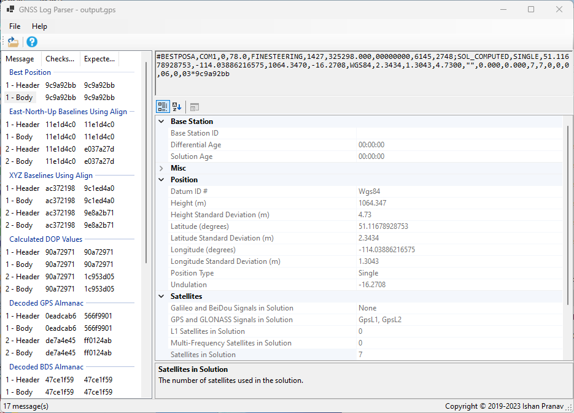

# GNSS Log Parser
This is a cross-platform library and application for parsing NovAtel GNSS command output message logs. The project includes a standalone class library, a cross-platform command-line tool, and a Windows GUI application.

This project is a [fork of the parser designed by Ishan Pranav](https://github.com/BeckmanAvionics/gps-output-parser) for [Arnold O. Beckman High School\'s Avionics Team](https://github.com/BeckmanAvionics), part of the Irvine CubeSat STEM Program. The software is designed for compatibility with NovAtel\'s OEM6 and OEM7 products.
## Screenshots

## API Documentation
The example below uses an ASCII parser to read messages from a string. Binary and Abbreviated ASCII messages are not supported.
```csharp
string value = @"#
BESTPOSA,COM1,0,90.5,FINESTEERING,1949,403742.000,02000000,b1f6,32768;
SOL_COMPUTED,SINGLE,51.11636937989,-114.03825348307,1064.533,-16.9000,
WGS84,1.3610,1.0236,2.4745,"""",0.000,0.000,19,19,19,19,00,06,00,33
*6e08fa22
";
AsciiGpsParser parser = new AsciiGpsParser();

await foreach (AsciiMessage message in parser.ParseAsync(value))
{
    // Process the message
}
```
### Built-in logs
Each [GNSS log](https://docs.novatel.com/OEM7/Content/Logs/Core_Logs.htm) needs a dedicated model in the parser. The following built-in logs are automatically registered.
| Command | Model Class |
| ------- | ----------- |
| [`ALIGNBSLNENU`](https://docs.novatel.com/OEM7/Content/Logs/ALIGNBSLNENU.htm) | `EnuBaselinesUsingAlignCommand` |
| [`ALIGNBSLNXYZ`](https://docs.novatel.com/OEM7/Content/Logs/ALIGNBSLNXYZ.htm) | `XyzBaselinesUsingAlignCommand` |
| [`ALIGNDOP`](https://docs.novatel.com/OEM7/Content/Logs/ALIGNDOP.htm) | `DopCommand` |
| [`ALMANAC`](https://docs.novatel.com/OEM7/Content/Logs/ALMANAC.htm) | `AlmanacCommand` |
| [`AUTHCODES`](https://docs.novatel.com/OEM7/Content/Logs/AUTHCODES.htm) | `AuthorizationCodesCommand` |
| [`AVEPOS`](https://docs.novatel.com/OEM7/Content/Logs/AVEPOS.htm) | `PositionAveragingCommand` |
| [`BDSALMANAC`](https://docs.novatel.com/OEM7/Content/Logs/BDSALMANAC.htm) | `BdsAlmanacCommand` |
| [`BDSCLOCK`](https://docs.novatel.com/OEM7/Content/Logs/BDSCLOCK.htm) | `BdsClockCommand` |
| [`BESTPOS`](https://docs.novatel.com/OEM7/Content/Logs/BESTPOS.htm) | `BestPositionCommand` |
| [`RXSTATUS`](https://docs.novatel.com/OEM7/Content/Logs/RXSTATUS.htm) | `ReceiverStatusCommand` |

### Custom logs
To add support for the GNSS [`TIME`](https://docs.novatel.com/OEM7/Content/Logs/TIME.htm) command, create a new class annotated with the `CommandAttribute`. The parser uses [CsvHelper](https://github.com/JoshClose/CsvHelper) to map strings to objects.
```csharp
[Command("TIME")] // Command name
public class TimeCommand
{
    [Index(0)] // Field position
    public GnssClockModelStatus Status { get; } 
}

public enum GnssClockModelStatus
{
    [Name("VALID")] // ASCII message representation
    Valid = 0, // Binary message representation

    [Name("CONVERGING")]
    Converging = 1,

    [Name("ITERATING")]
    Iterating = 2,

    [Name("INVALID")]
    Invalid = 3
}
```
Then, add the class to the parser:

```csharp
parser.TryRegister<TimeCommand>();
```
## Command-line interface
Provide a path to a log file:
```posh
IrvineCubeSat.GpsParser.Console.exe "Logs\Log1.gps"
```
Or a string:
```posh
IrvineCubeSat.GpsParser.Console.exe "#BESTPOSA,COM1,0,90.5,FINESTEERING,1949,403742.000,02000000,b1f6,32768;SOL_COMPUTED,SINGLE,51.11636937989,-114.03825348307,1064.533,-16.9000,WGS84,1.3610,1.0236,2.4745,UNKNOWN,0.000,0.000,19,19,19,19,00,06,00,33*6e08fa22"
```
Then retrieve the JSON output:
```json
[
  {
    "header": {
      "command": "BESTPOS",
      "port": "COM1",
      "sequenceNumber": 0,
      "idleTime": 90.5,
      "timeStatus": 180,
      "week": 1949,
      "weekOffset": "4.16:09:02",
      "timestamp": "2017-05-17T16:09:02",
      "receiverStatus": 33554432,
      "receiverSoftwareVersion": 32768
    },
    "command": {
      "solutionStatus": 0,
      "positionType": 16,
      "latitude": 51.11636937989,
      "longitude": -114.03825348307,
      "height": 1064.533,
      "undulation": -16.9,
      "datumIdNumber": 61,
      "latitudeStandardDeviation": 1.361,
      "longitudeStandardDeviation": 1.0236,
      "heightStandardDeviation": 2.4745,
      "baseStationId": "UNKNOWN",
      "differentialAge": "00:00:00",
      "solutionAge": "00:00:00",
      "satellitesTracked": 19,
      "satellitesInSolution": 19,
      "l1SatellitesInSolution": 19,
      "multiFrequencySatellitesInSolution": 19
    },
    "checksum": 1846082082,
    "expectedChecksum": 1696927800,
    "raw": "BESTPOSA,COM1,0,90.5,FINESTEERING,1949,403742.000,02000000,b1f6,32768;SOL_COMPUTED,SINGLE,51.11636937989,-114.03825348307,1064.533,-16.9000,WGS84,1.3610,1.0236,2.4745,UNKNOWN,0.000,0.000,19,19,19,19,00,06,00,33"
  }
]
```
The command-line interface supports all .NET-compatible operating systems.
## License
This repository is licensed with the [MIT](LICENSE.txt) license.
## Attribution
This software uses third-party libraries or other resources that may be
distributed under licenses different than the software. Please see the third-party notices included [here](THIRD-PARTY-NOTICES.txt).
## References
- [32-bit CRC](https://docs.novatel.com/OEM7/Content/Messages/32_Bit_CRC.htm)
- [ASCII Messages](https://docs.novatel.com/OEM7/Content/Messages/ASCII.htm)
- [Messages](https://docs.novatel.com/OEM7/Content/Messages/Messages.htm)
- [NovAtel OEM6 Family Firmware Reference Manual](https://hexagondownloads.blob.core.windows.net/public/Novatel/assets/Documents/Manuals/om-20000129/om-20000129.pdf)
- [NovAtel OEM7 GNSS Logs](https://docs.novatel.com/OEM7/Content/Logs/Core_Logs.htm)
